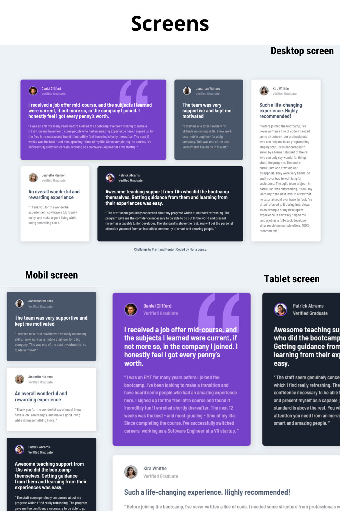

# Testimonials grid section

This is a solution to the Testimonials grid section challenge on Frontend Mentor

## Table of contents

- [Overview](#overview)
  - [The challenge](#the-challenge)
  - [Screenshot](#screenshot)
  - [Links](#links)
- [My process](#my-process)
  - [Built with](#built-with)
- [Author](#author)

## Overview

### The challenge

Users should be able to:

- View the optimal layout for the site depending on their device's screen size (mobile, tablet or desktop)

### Screenshot

### Links

- Solution URL: [Add solution URL here](https://your-solution-url.com)
- Live Site URL: [https://oppahero.github.io/testimonials-grid-section/](https://oppahero.github.io/testimonials-grid-section/)

## My process

### Built with

- Semantic HTML5 markup
- CSS custom properties
- Flexbox
- CSS Grid
- Mobile-first workflow
- Media queries
- Bem notation

#### CSS Specificity Graph

## Author

- Frontend Mentor - [@oppahero](https://www.frontendmentor.io/profile/oppahero)
